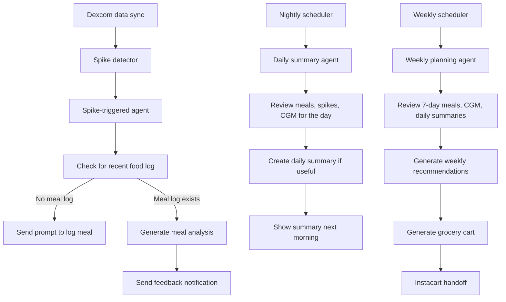

# Foodie Agent Loop Design

This document describes a structured agent system for Foodie that operates on three rhythms:

1. spike-triggered feedback
2. daily overnight review
3. weekly grocery planning

The goal is to keep the system proactive and personalized without making it vague or overly autonomous.

---

## Overview

The proposed agent system is event-driven and scheduled.

Instead of running continuously without structure, the backend activates the right workflow at the right time:

- when a glucose spike is detected
- once overnight to review the day
- once per week to plan groceries

This design keeps the system:

- systematic
- easy to reason about
- aligned with the user’s schedule
- easier to implement and validate

---

## 1. Spike-Triggered Agent Loop

### Trigger

- new Dexcom CGM data is synced
- backend detects a spike event

### Workflow

1. detect a spike from CGM data
2. check for a nearby food log in a reasonable time window
3. branch based on what is found

### If no food log exists

- send a notification prompting the user to log what they ate
- example:
  - “We noticed your glucose rose. Want to log what you ate?”

### If a food log exists

- generate meal-specific analysis
- produce a concise explanation or recommendation
- optionally send a notification
- example:
  - “Your glucose rose after this meal. Tap to see feedback.”

### Outputs

- spike event record
- optional meal feedback record
- optional notification record

### Why this loop matters

This makes the system proactive only when something meaningful happens.

---

## 2. Daily Overnight Agent Loop

### Trigger

- scheduled once every 24 hours
- ideally during the user’s sleep window, such as 2–4 AM local time

### Workflow

1. gather the previous day’s:
   - meal logs
   - glucose data
   - spike events
2. summarize what happened
3. decide whether the day contains anything worth surfacing
4. if useful, create a daily summary for the next morning

### Example insights

- meals that repeatedly caused spikes
- meals that kept glucose steady
- missed meal logs near major spikes
- time in range or variability patterns

### Outputs

- daily summary record
- optional morning notification

### Why this loop matters

This gives the user a short reflection on the day without interrupting them too frequently.

---

## 3. Weekly Planning Agent Loop

### Trigger

- scheduled once per week
- for example Sunday night or Monday morning

### Workflow

1. gather the last 7 days of:
   - meal logs
   - CGM data
   - spike events
   - daily summaries
   - care goals
   - diet preferences
2. identify recurring patterns
3. generate weekly recommendations
4. generate a grocery cart draft
5. optionally notify the user that their weekly plan is ready

### Example outputs

- weekly summary
- grocery recommendations
- cart draft
- Instacart handoff

### Why this loop matters

This is the right place for longer-term planning and grocery support.

---

## Recommended Architecture

---

## Design Principles

### Use deterministic logic for core triggers

Do not let the language model decide whether a spike happened.

Use deterministic backend rules for:

- spike detection
- meal-to-spike matching windows
- whether a daily summary should be created

### Use AI for interpretation and recommendations

Use AI for:

- explaining why a meal may have caused a rise
- generating concise feedback text
- suggesting food swaps
- generating weekly grocery recommendations

This keeps the system more stable and easier to validate.

---

## Suggested Trigger Rules

### Spike-triggered

Trigger when:

- glucose rises above a threshold
- or the glucose delta exceeds a threshold within a post-meal window

Example:

- delta > 30 mg/dL
- and peak > 180 mg/dL
- within 2 hours

### Daily summary

Generate a summary only if one of these is true:

- at least one notable spike occurred
- time in range was meaningfully low
- a repeated food pattern appears
- a likely missed meal log occurred near a spike

### Weekly summary

Run every week, but only notify the user if:

- there is something actionable
- or a grocery cart was generated

---

## Data and Memory

This system should use structured memory, not vague freeform memory.

Recommended records:

- meal_logs
- glucose_readings
- spike_events
- daily_summaries
- weekly_summaries
- recommendations
- notifications
- cart_drafts
- agent_runs

This gives the agent persistent context across time while keeping the system auditable.

---

## Why this is a strong product structure

This design supports three levels of support:

- immediate support:
  - spike-triggered prompts and meal-specific feedback
- daily reflection:
  - daily summary each morning when needed
- weekly planning:
  - grocery recommendations and cart generation

That creates a coherent user journey:

- react to spikes
- reflect daily
- plan weekly

---

## Recommended MVP Implementation Order

### Phase 1

- spike detection
- food-log check
- notification prompting user to log a meal or review feedback

### Phase 2

- nightly daily summary
- morning summary card or notification

### Phase 3

- weekly recommendation generation
- grocery cart creation
- Instacart handoff

---

## Summary

Foodie should move toward a structured agent system with three coordinated loops:

1. spike-triggered support
2. daily overnight review
3. weekly grocery planning

This provides proactive, personalized support while remaining systematic, interpretable, and technically manageable.
