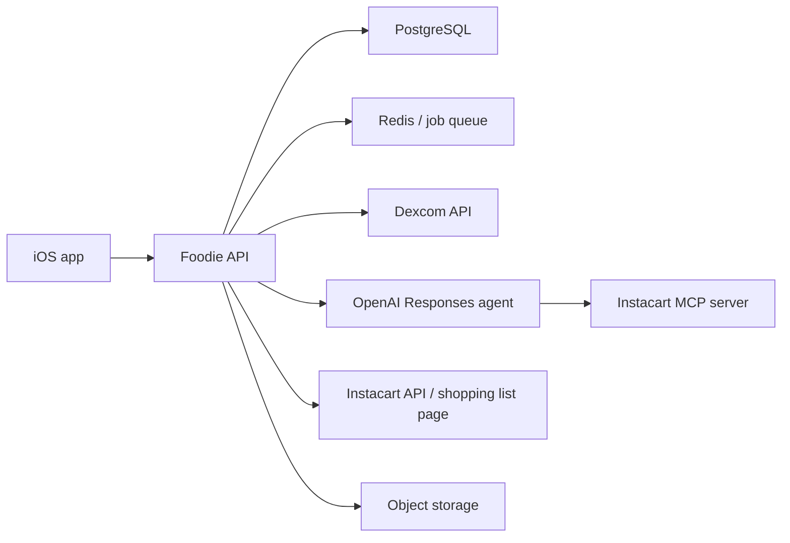

# Foodie Backend Specification

## Purpose

This backend exists to do the parts of the product that should not live in the iOS app:

- Dexcom OAuth and token storage
- CGM ingestion and normalization
- retrospective spike detection
- meal analysis and coaching orchestration
- grocery/cart generation
- Instacart handoff
- OpenAI agent orchestration with Instacart MCP or direct Instacart APIs

The iOS app should be a thin client for UI, local cache, and offline tolerance. It should not own Dexcom tokens, OpenAI keys, or Instacart secrets.

## Scope

### In scope for prototype

- Dexcom sandbox integration
- connection lifecycle for Dexcom
- weekly CGM summary API for the app
- meal-log ingestion and persistence
- deterministic meal-to-glucose attribution
- feedback generation for logged meals
- cart draft generation from meals + profile + CGM summaries
- Instacart shopping-list / checkout handoff
- OpenAI-powered meal planning and explanation flows

### Out of scope for first backend version

- real-time CGM alerting
- full clinical decision support
- multi-tenant enterprise admin tools
- complex role-based access control
- insurance / billing workflows

## External Constraints

### Dexcom

- Dexcom OAuth tokens should be stored on backend servers, not in the mobile app.
- Dexcom Web API data availability is delayed for common mobile-uploaded data; the prototype should be framed as retrospective coaching, not immediate live alerts.
- Dexcom query windows are bounded and sync logic must account for the API’s time-range limits.

### OpenAI + MCP

- The OpenAI agent should run on the backend.
- MCP should be exposed to the backend agent, not directly to the mobile app.
- The deterministic grocery/cart path must keep working even if the agent or MCP path fails.

### Instacart

- Use direct shopping-list page creation or checkout handoff for the core path.
- Use MCP for refinement and planning, not as the sole execution path.

## Recommended Technology Stack

### Application stack

- Language: Python 3.12
- API framework: FastAPI
- Validation: Pydantic v2
- ORM: SQLAlchemy 2.x
- Migrations: Alembic
- Database: PostgreSQL
- Background jobs: Arq or RQ backed by Redis
- Object storage: local filesystem in dev, S3-compatible bucket in hosted environments
- Observability: structured JSON logs + Sentry + health endpoints

### Why this stack

- Python is the most direct fit for OpenAI agent orchestration and meal-analysis pipelines.
- FastAPI is fast to ship, typed, and simple to operate.
- PostgreSQL is the cleanest fit for relational health/logging data with time-series queries at prototype scale.
- Redis-backed background jobs are enough for sync and retry workflows without adopting a heavy orchestration system.

## System Architecture



## Repository Layout

Recommended new repo at `/backend` or separate service repo:

```text
backend/
  app/
    api/
      routes/
      dependencies.py
      errors.py
    config/
      settings.py
      logging.py
    db/
      base.py
      session.py
      models/
      migrations/
    schemas/
    services/
      dexcom/
      glucose/
      meals/
      feedback/
      carts/
      instacart/
      agent/
      notifications/
    jobs/
    clients/
      dexcom_client.py
      openai_client.py
      instacart_client.py
    main.py
  tests/
  pyproject.toml
  Dockerfile
```

## Core Responsibilities by Module

### `services/dexcom`

- start OAuth
- validate `state`
- exchange auth code for tokens
- refresh expired access tokens
- revoke / disconnect
- record sync checkpoints

### `services/glucose`

- fetch Dexcom `dataRange`
- sync EGV readings for bounded windows
- normalize timestamps and trend values
- store raw and normalized readings
- compute weekly summaries

### `services/meals`

- store meal logs
- store meal assets and parsed representations
- manage meal-source metadata
- support photo, voice, text, and barcode ingestion

### `services/feedback`

- attribute meals to post-meal glucose windows
- detect spike events deterministically
- generate concise user-facing feedback
- request LLM help only for explanation language and meal-plan refinement

### `services/carts`

- generate deterministic cart drafts from profile + meals + CGM summaries
- persist cart versions and item provenance
- support add/remove/replace item operations

### `services/instacart`

- create shopping-list pages
- return checkout / handoff URLs
- optionally expose Instacart MCP tools to the backend agent

### `services/agent`

- run OpenAI Responses workflows
- pass structured context only
- use JSON-schema-constrained outputs
- call Instacart MCP tools only for planning/refinement tasks

## Identity Model

The backend does not need full user accounts in v1, but it does need a stable app user record.

### `users`

- `id` UUID PK
- `created_at`
- `updated_at`
- `display_name`
- `timezone`
- `onboarding_completed_at`
- `demo_mode` boolean

## Data Model

### `patient_profiles`

- `user_id` PK/FK
- `diet_preferences` JSONB
- `diet_needs` JSONB
- `activity_level`
- `care_goals` JSONB
- `support_preferences` JSONB
- `uses_cgm` boolean
- `created_at`
- `updated_at`

### `external_connections`

- `id` UUID PK
- `user_id` FK
- `provider` enum: `dexcom`, `instacart`
- `status` enum: `disconnected`, `pending`, `connected`, `error`
- `display_name`
- `connected_at`
- `last_sync_at`
- `last_error_code`
- `last_error_message`
- `created_at`
- `updated_at`

### `dexcom_tokens`

- `connection_id` PK/FK
- `access_token_encrypted`
- `refresh_token_encrypted`
- `token_type`
- `expires_at`
- `scope`
- `last_refreshed_at`
- `created_at`
- `updated_at`

### `glucose_readings`

- `id` UUID PK
- `user_id` FK
- `provider` enum
- `provider_reading_id` nullable unique
- `system_time`
- `display_time`
- `value_mgdl`
- `trend`
- `transmitter_generation`
- `recorded_at`
- `ingested_at`

Indexes:

- `(user_id, system_time desc)`
- `(user_id, recorded_at desc)`
- unique `(provider, provider_reading_id)` when present

### `glucose_sync_state`

- `user_id` PK/FK
- `last_successful_sync_at`
- `last_requested_start`
- `last_requested_end`
- `cursor_hint` nullable
- `created_at`
- `updated_at`

### `meal_logs`

- `id` UUID PK
- `user_id` FK
- `logged_at`
- `source` enum: `photo`, `voice`, `text`, `barcode`, `manual`, `imported`
- `summary`
- `raw_input`
- `notes`
- `created_at`
- `updated_at`

### `meal_assets`

- `id` UUID PK
- `meal_log_id` FK
- `kind` enum: `photo`, `audio`, `text`, `barcode`
- `storage_key`
- `mime_type`
- `preview_text`
- `created_at`

### `meal_analyses`

- `meal_log_id` PK/FK
- `meal_type`
- `estimated_calories`
- `confidence`
- `nutrition_json` JSONB
- `health_index`
- `health_level`
- `health_axes_json` JSONB
- `health_tags` JSONB
- `highlights` JSONB
- `model_version`
- `created_at`
- `updated_at`

### `spike_events`

- `id` UUID PK
- `user_id` FK
- `meal_log_id` FK
- `baseline_mgdl`
- `peak_mgdl`
- `delta_mgdl`
- `time_to_peak_minutes`
- `returned_to_range_at` nullable
- `window_start`
- `window_end`
- `confidence`
- `classification` enum: `none`, `mild`, `moderate`, `high`
- `prompt_eligible` boolean
- `created_at`

### `meal_feedback`

- `id` UUID PK
- `meal_log_id` FK unique
- `mode` enum: `predicted`, `measured`
- `headline`
- `summary`
- `coach_message`
- `suggested_swap`
- `suggested_cart_items` JSONB
- `source_event_id` nullable FK to `spike_events`
- `created_at`
- `updated_at`

### `cart_drafts`

- `id` UUID PK
- `user_id` FK
- `title`
- `source` enum: `meal_feedback`, `weekly_plan`, `manual`, `grocery_planner`
- `store_name`
- `currency_code`
- `subtotal_estimate`
- `voucher_amount`
- `total_due_estimate`
- `status` enum: `draft`, `submitted`, `expired`
- `created_at`
- `updated_at`

### `cart_items`

- `id` UUID PK
- `cart_draft_id` FK
- `name`
- `category`
- `quantity_label`
- `estimated_price`
- `reason`
- `source_meal_log_id` nullable FK
- `source_feedback_id` nullable FK
- `position`
- `created_at`
- `updated_at`

### `instacart_handoffs`

- `id` UUID PK
- `cart_draft_id` FK
- `shopping_list_page_url`
- `checkout_url` nullable
- `provider_status`
- `requested_at`
- `completed_at` nullable
- `raw_response_json` JSONB

### `agent_runs`

- `id` UUID PK
- `user_id` FK
- `workflow` enum: `meal_plan`, `feedback_copy`, `cart_refinement`
- `status` enum: `queued`, `running`, `succeeded`, `failed`
- `model`
- `input_json` JSONB
- `output_json` JSONB
- `tool_trace_json` JSONB
- `error_message`
- `created_at`
- `updated_at`

## API Surface

### Auth and session assumptions

The prototype can use a simple authenticated app user header or JWT. Pick one and keep it consistent. For local dev, a demo user can be auto-created.

All routes below assume an authenticated app user context.

### Health

#### `GET /healthz`

Returns process health.

#### `GET /readyz`

Returns DB / Redis / external-config readiness.

### Profile

#### `GET /profile`

Returns current patient profile and onboarding state.

#### `PUT /profile`

Upserts:

- diet preferences
- diet needs
- activity level
- care goals
- support preferences
- uses CGM

### Dexcom connection

#### `POST /dexcom/connect/start`

Request:

```json
{}
```

Response:

```json
{
  "authorization_url": "https://...",
  "connection_status": "pending"
}
```

Behavior:

- creates or updates `external_connections`
- generates and stores OAuth `state`
- returns Dexcom authorization URL

#### `GET /dexcom/connect/callback`

Query params:

- `code`
- `state`
- error params if authorization failed

Behavior:

- validates `state`
- exchanges code for tokens
- stores encrypted tokens
- marks connection `connected`
- redirects to app deep link such as `foodie://dexcom-connected`

#### `GET /dexcom/connect/status`

Response:

```json
{
  "provider": "dexcom",
  "status": "connected",
  "connected_at": "2026-04-03T12:00:00Z",
  "last_sync_at": "2026-04-03T12:05:00Z",
  "error_message": null
}
```

#### `POST /dexcom/disconnect`

Behavior:

- deletes or invalidates stored tokens
- marks connection `disconnected`
- leaves historical glucose data intact

#### `POST /dexcom/sync`

Behavior:

- enqueues or performs a sync
- returns accepted status

Response:

```json
{
  "status": "queued"
}
```

### CGM

#### `GET /cgm/summary/weekly`

Query params:

- `anchor_date` optional ISO-8601 date

Response:

```json
{
  "summary": {
    "start_date": "2026-03-27T00:00:00Z",
    "end_date": "2026-04-03T00:00:00Z",
    "target_low_mgdl": 70,
    "target_high_mgdl": 180,
    "average_mgdl": 154.2,
    "time_in_range_percent": 82,
    "readings": []
  }
}
```

#### `GET /cgm/readings`

Query params:

- `start`
- `end`

Returns normalized readings for graphing and meal attribution.

### Meals

#### `POST /meals`

Creates a meal log.

Request:

```json
{
  "logged_at": "2026-04-03T12:15:00Z",
  "source": "photo",
  "summary": "Chicken and fries",
  "raw_input": "optional transcript or text",
  "notes": null,
  "assets": [
    {
      "kind": "photo",
      "storage_key": "meal-assets/abc.jpg"
    }
  ]
}
```

Response:

```json
{
  "meal_log_id": "uuid",
  "status": "created"
}
```

#### `GET /meals`

Returns recent meal logs.

#### `GET /meals/{meal_log_id}`

Returns a single meal log and its analysis.

#### `POST /meals/{meal_log_id}/analyze`

Behavior:

- parses meal contents
- creates or updates `meal_analyses`
- may call OpenAI for extraction/explanation

#### `GET /meals/{meal_log_id}/feedback`

Returns `MealFeedback`.

If a spike event exists and enough CGM data has arrived, return measured feedback. Otherwise return predicted feedback.

### Spike events

#### `GET /spikes/recent`

Returns recent spike events eligible for prompting or review.

### Carts

#### `POST /cart/generate`

Generates a deterministic draft from profile, recent meals, glucose summary, and optionally a meal feedback record.

Request:

```json
{
  "source": "weekly_plan"
}
```

Response:

```json
{
  "draft": {
    "id": "uuid",
    "title": "Weekly groceries",
    "source": "weekly_plan",
    "store_name": "GIANT",
    "subtotal_estimate": 42.10,
    "voucher_amount": 40.00,
    "total_due_estimate": 2.10,
    "items": []
  }
}
```

#### `GET /cart/latest`

Returns the most recent active draft.

#### `PATCH /cart/{cart_id}`

Supports item add/remove/update operations.

#### `POST /cart/{cart_id}/instacart`

Creates Instacart handoff for the draft.

Response:

```json
{
  "shopping_list_page_url": "https://...",
  "checkout_url": "https://..."
}
```

### Agent workflows

#### `POST /agent/meal-plan`

Inputs:

- patient profile
- recent meals
- weekly CGM summary
- care goals

Outputs:

- next-week meal ideas
- candidate grocery list changes
- rationale

#### `POST /agent/cart-refine`

Inputs:

- current cart draft
- meal plan or feedback

Outputs:

- updated items
- substitutions
- rationale

## Dexcom Sync Design

### Sync strategy

For the prototype, use hybrid sync:

1. on demand when the app requests weekly summary and local data is stale
2. scheduled background sync every 4-6 hours for connected users

### Sync algorithm

1. load user connection and token
2. refresh access token if needed
3. call Dexcom `dataRange`
4. determine bounded sync windows
5. fetch `egvs`
6. upsert normalized readings
7. recompute affected summaries
8. update `external_connections.last_sync_at` and `glucose_sync_state`

### Token refresh behavior

- refresh before expiry with a safety buffer
- atomically replace rotated refresh tokens
- on refresh failure, mark connection error and require reconnect

## Meal-to-Glucose Attribution

This logic should be deterministic.

### Inputs

- meal log timestamp
- prior 30-60 minute baseline window
- post-meal 2-4 hour observation window
- target range

### Derived measures

- baseline glucose
- peak glucose
- absolute rise
- time to peak
- time back in range
- confidence score based on data completeness and nearby meals

### Output

A `spike_event` with:

- severity
- confidence
- eligibility for prompt / feedback

The LLM should not decide whether a spike happened. It should explain a structured spike event in user-friendly language.

## Agent Design

### Principles

- structured inputs
- schema-constrained outputs
- deterministic fallback path
- limited tool surface

### Inputs to the agent

- `patient_profile`
- `weekly_glucose_summary`
- `recent_meals`
- optional `meal_feedback`
- optional `cart_draft`

### Outputs from the agent

- meal plan suggestions
- one-swap feedback copy
- cart refinement suggestions

### Tool usage

- prefer direct internal services for data fetch
- expose Instacart MCP only for refinement workflows
- do not use MCP for every cart creation request

## Security Requirements

- encrypt Dexcom and Instacart secrets at rest
- never log raw access or refresh tokens
- redact meal raw input if it may contain sensitive text
- sign or validate app-auth tokens on every request
- keep audit logs for external-provider actions
- separate demo and production environments

## Environment Configuration

### Required environment variables

- `APP_ENV`
- `API_BASE_URL`
- `DATABASE_URL`
- `REDIS_URL`
- `DEXCOM_CLIENT_ID`
- `DEXCOM_CLIENT_SECRET`
- `DEXCOM_REDIRECT_URI`
- `OPENAI_API_KEY`
- `INSTACART_API_KEY` or corresponding platform credentials
- `INSTACART_MCP_BASE_URL` if MCP is remote
- `APP_DEEP_LINK_BASE` such as `foodie://`
- `SENTRY_DSN` optional
- `OBJECT_STORAGE_BUCKET` optional in dev

## Deployment Environments

### Local development

- FastAPI on `localhost`
- Postgres via Docker
- Redis via Docker
- ngrok or cloudflared tunnel for Dexcom callback

### Prototype staging

- Render / Railway / Fly.io
- managed Postgres
- managed Redis
- S3-compatible object storage

### Production-hardening direction

- private networking where possible
- encrypted secrets manager
- zero-downtime migrations
- background worker autoscaling

## Error Handling

Use a stable error envelope:

```json
{
  "error": {
    "code": "dexcom_refresh_failed",
    "message": "Dexcom connection needs to be reconnected"
  }
}
```

Core error codes:

- `unauthorized`
- `validation_error`
- `dexcom_not_connected`
- `dexcom_auth_failed`
- `dexcom_refresh_failed`
- `dexcom_sync_failed`
- `meal_analysis_failed`
- `cart_generation_failed`
- `instacart_handoff_failed`
- `agent_failed`

## Observability

### Logs

Structured JSON logs with:

- request ID
- user ID
- provider
- workflow
- latency
- status

### Metrics

- Dexcom connect success rate
- token refresh success rate
- sync duration
- sync failure rate
- glucose summary latency
- meal analysis latency
- cart generation latency
- Instacart handoff success rate
- agent workflow success/failure rate

### Tracing

Add request and job correlation IDs end to end.

## Testing Strategy

### Unit tests

- Dexcom auth-state validation
- token refresh logic
- glucose window computation
- spike detection
- cart generation rules

### Integration tests

- Dexcom callback flow
- weekly summary generation
- meal-feedback generation
- Instacart handoff creation

### Contract tests

- response schemas used by the iOS app

### Demo-mode tests

- full seeded flow without live Dexcom

## Delivery Plan

### Phase 1: backend scaffold

- FastAPI app
- DB models + migrations
- auth/user context stub
- health routes
- Dexcom connect start/status endpoints

### Phase 2: Dexcom integration

- callback route
- token storage
- sync service
- weekly summary API

### Phase 3: meals and feedback

- meal-log endpoints
- meal analysis endpoint
- deterministic spike engine
- feedback endpoint

### Phase 4: carts and Instacart

- cart generation endpoint
- cart update endpoint
- Instacart handoff endpoint

### Phase 5: OpenAI agent

- meal-plan workflow
- cart-refinement workflow
- prompt-safe structured outputs

## Open Questions

- Will the prototype backend live inside this repo or a separate repo?
- Will the app use JWT auth, anonymous demo sessions, or a simple one-user prototype mode first?
- Do we want background sync in v1, or on-demand sync only?
- Will meal images be uploaded to backend object storage immediately or kept local until analysis is requested?
- Do we want to persist raw Dexcom payloads for debugging, or normalized data only?

## Recommended Immediate Next Step

Build the backend scaffold first:

1. create FastAPI service
2. create Postgres schema for users, connections, Dexcom tokens, glucose readings
3. implement `/dexcom/connect/start`
4. implement `/dexcom/connect/status`
5. wire the iOS app to those endpoints

This is the smallest slice that turns Dexcom from a mock concept into a real system boundary.

## Sources

- Dexcom Authentication: https://developer.dexcom.com/docs/dexcom/authentication
- Dexcom Scopes & Access: https://developer.dexcom.com/docs/dexcom/scopes-access
- Dexcom API V3 Endpoint Overview: https://developer.dexcom.com/docs/dexcomv3/endpoint-overview
- Dexcom Sandbox Data: https://developer.dexcom.com/docs/dexcom/sandbox-data
- Instacart shopping list page API: https://docs.instacart.com/developer_platform_api/api/products/create_shopping_list_page/
- Instacart MCP tutorial: https://docs.instacart.com/developer_platform_api/guide/tutorials/mcp/
- OpenAI MCP guide: https://platform.openai.com/docs/mcp/
- OpenAI tools / Responses guide: https://platform.openai.com/docs/guides/tools?api-mode=responses
